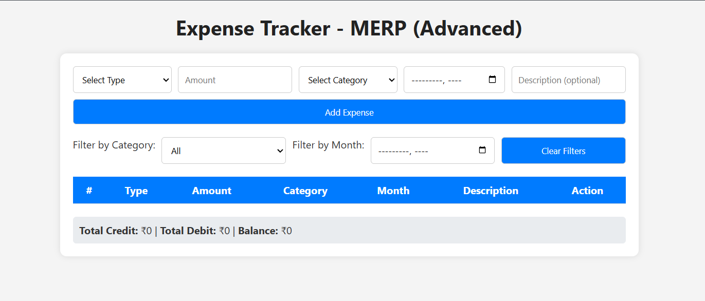

💰 MERP (Advanced) - Expense Tracker
Welcome to MERP (Advanced) – your personal, simple, and effective monthly expense tracker built using HTML, CSS, and JavaScript!

This tool helps you track your credits and debits, manage your monthly budget, and see a clear summary of your finances — all saved locally in your browser. No backend, no setup, just run and use!

✨ Features
✅ Add Credit or Debit transactions

🏷️ Categorize expenses (Food, Travel, Shopping, Bills, etc.)

📅 Track by month

📝 Optional description for each entry

🔍 Filter by category or month

📊 View total credits, debits, and balance

🗑️ Remove individual entries

💾 Auto-saved using browser's localStorage

🚀 Getting Started
Just open the index.html file in any browser — no installations or configurations required!

bash
Copy
Edit
1. Download or clone the repository
2. Open index.html in your preferred browser
📸 Preview

🛠️ Tech Stack
HTML5

CSS3

JavaScript (Vanilla)

Browser's localStorage for data persistence

🧠 How It Works
You fill in the form with the type (Credit/Debit), amount, category, month, and (optional) description.

The data is saved into localStorage.

Transactions are displayed in a dynamic table.

You can filter and view a summary at the bottom.

🔄 Reset or Clear Data?
Just open the browser’s developer tools, go to Application > Local Storage, and delete the expenses key. Or, you can add a Clear All button for convenience (feel free to ask if you need help doing that 😊).

🧑‍💻 Author
Developed with ❤️ by Prem
Student at College of Engineering, Guindy - Anna University
IT Department 📚

📬 Feedback or Help?
If you're stuck or want to improve it further (like adding charts, dark mode, or exporting to CSV), feel free to reach out. Happy to help anytime!